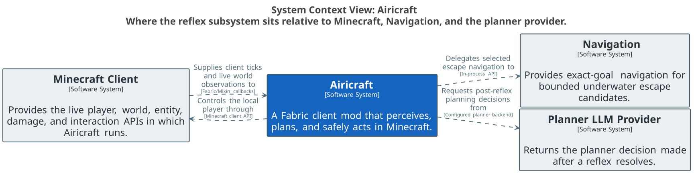
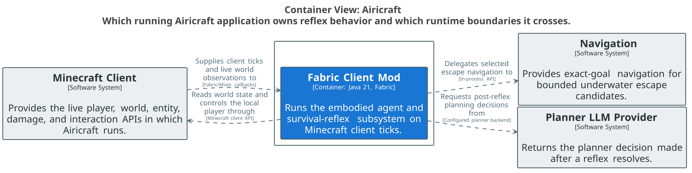
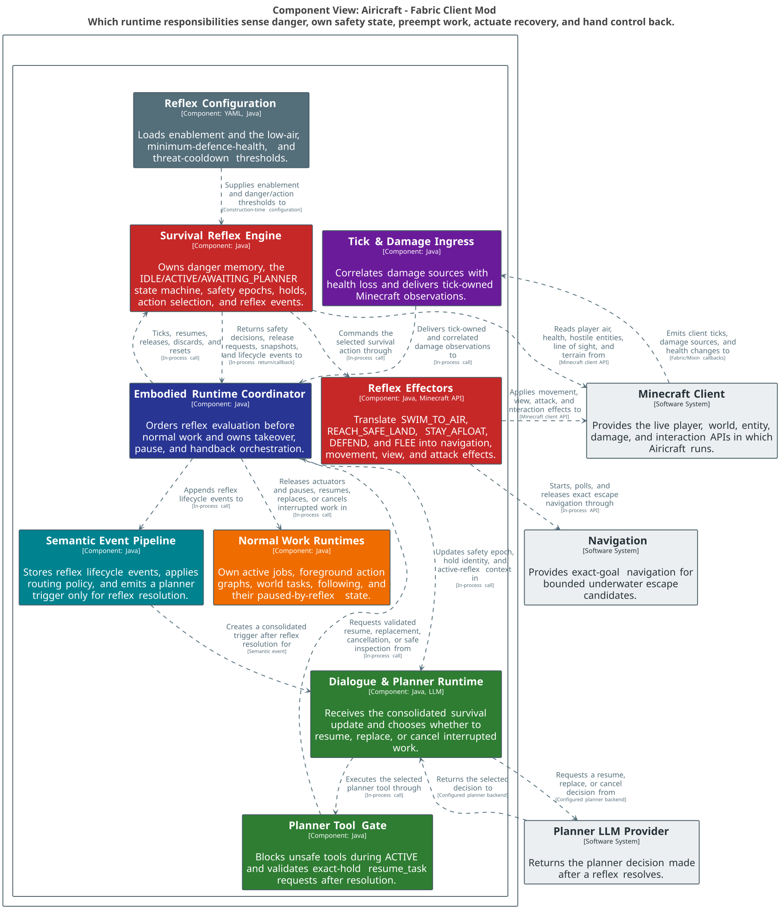
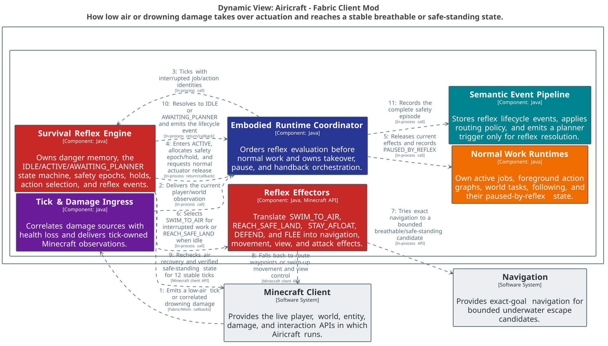

# Airicraft survival reflex architecture

The policy text below reflects the 2026-09-10 combat-first change. The diagrams and [`workspace.dsl`](workspace.dsl) retain the earlier flee-policy snapshot; their ownership boundaries still apply, but their mob detection and action choices are historical.

> The diagrams draw navigation as an external system. It is now the in-house navigation core inside the mod; the
> boxes were renamed but not restyled or re-rendered, so read "External" as "a separate component".

## Reading the subsystem

The reflex is an in-process safety layer owned by `EmbodiedAgentRuntime`. It runs before normal jobs and action graphs on every client tick. It does not ask the planner what to do while immediate danger is active: it detects the supported danger, takes actuator ownership, selects a hard-coded survival action, and only returns decision-making to the planner after the danger resolves.

The context view answers: **where does reflex behavior cross the Airicraft boundary?**

The runtime view answers: **which running Airicraft application owns the behavior, and which runtime boundaries does it cross?**

The static component view answers: **which responsibilities sense danger, own safety state, preempt normal work, actuate recovery, and hand control back?**

## State and ownership protocol

| State | Normal work | Reflex actuation | Exit |
| --- | --- | --- | --- |
| `IDLE` | May run | None | Supported danger starts a new safety epoch. |
| `ACTIVE` | Held as `PAUSED_BY_REFLEX` | Always owned by the reflex | Danger resolves to `IDLE` when no work was interrupted, otherwise `AWAITING_PLANNER`. |
| `AWAITING_PLANNER` | Still held | Drowning holds may continue reaching safe land or staying afloat; mob holds do not actuate | Exact `holdId` resume, replacement/cancellation, or automatic safe-land release returns to `IDLE`. |

`safetyEpoch` invalidates stale planner work across reflex episodes. `holdId` correlates a resolution decision to the exact interrupted job/action execution; `resume_task` rejects an active reflex, a missing hold, or a stale hold ID.

## Danger and action policy

| Cause | Detection | Immediate action | Resolution |
| --- | --- | --- | --- |
| Drowning | Drowning damage, or submerged air at/below `lowAirTicks` (default `100`) | `SWIM_TO_AIR` when work was interrupted; otherwise `REACH_SAFE_LAND`. An exhausted safe-land search changes to `STAY_AFLOAT`. | Air recovery must remain stable for 12 ticks. Unsafe idle recovery can retain a safety hold until verified safe standing. |
| Mob attack | Correlated damage from a non-player living attacker, or a confirmed AI target matching the player. Integrated-server target reads execute asynchronously on the server thread; remote clients fall back to damage and any available target evidence. Proximity alone does not admit a threat. Non-ranged mobs must also be within six blocks (3D distance), both on admission and while tracked. | `DEFEND` regardless of health, mob count or mob type. Pursue through navigation and use cooldown-timed melee attacks with the best hotbar weapon. Drowning recovery retains priority. | Threats clear and damage cooldown expires, or every pursuit route stays blocked and occluded for 200 ticks. Long/partial/unknown routes are not shelter. |

Normal navigation planning enables mob avoidance (the `avoidMobs` setting) with a 16-block radius and cost multiplier 4. These are soft path costs, not a guarantee against detection. An already aggressive ranged-capable mob remains a combat target while alive and loaded. Non-ranged mobs beyond six blocks are ignored by combat, even if previously tracked; they can become threats again when they approach. The existing recent-damage cooldown still applies. Ranged capability includes the Minecraft ranged/crossbow interfaces and innate projectile, beam or spell attackers; it is conservatively based on capability rather than current equipment. A blocked and occluded mob is not readmitted solely for retaining its AI target after shelter resolution. The legacy `defendMinHealthRatio` configuration remains parseable but no longer controls combat admission or retreat.

There is no open-ground fleeing or automatic tunnel construction. Existing blocked terrain can provide shelter; a future block-placement tactic must prove it blocks pursuit before replacing combat. Drowning retains its bounded water-aware navigation and recovery behavior.

## Runtime stories

The drowning view answers: **how does low air or drowning damage take over actuation and reach a stable breathable or safe-standing state?**

The historical mob view shows the previous proximity/defence/flee policy; use the policy table above for current behavior.

The planner-handback view answers: **how does a resolved reflex create one correlated planner decision and resume only the exact held task?**

## Source evidence

- Sensing and tick order: [`LocalDamageTracker.java`](../../../src/client/java/ai/moeru/airicraft/agent/LocalDamageTracker.java), [`EmbodiedAgentRuntime.java`](../../../src/client/java/ai/moeru/airicraft/agent/EmbodiedAgentRuntime.java)
- State machine, policy, threat memory, events, and holds: [`SurvivalReflexRuntime.java`](../../../src/client/java/ai/moeru/airicraft/agent/reflex/SurvivalReflexRuntime.java), [`SurvivalReflexSnapshot.java`](../../../src/client/java/ai/moeru/airicraft/agent/reflex/SurvivalReflexSnapshot.java)
- Underwater route search/navigation effects: [`MinecraftUnderwaterEscapeController.java`](../../../src/client/java/ai/moeru/airicraft/agent/tasks/MinecraftUnderwaterEscapeController.java), [`UnderwaterEscapeSearch.java`](../../../src/client/java/ai/moeru/airicraft/agent/tasks/UnderwaterEscapeSearch.java), [`UnderwaterEscapeNavigator.java`](../../../src/client/java/ai/moeru/airicraft/agent/tasks/UnderwaterEscapeNavigator.java)
- Normal-work pause/resume: [`ActiveJobRuntime.java`](../../../src/client/java/ai/moeru/airicraft/agent/job/ActiveJobRuntime.java), [`ActionGraphCoordinator.java`](../../../src/client/java/ai/moeru/airicraft/agent/actions/ActionGraphCoordinator.java)
- Planner safety gate and resume tool: [`EmbodiedPlannerActionToolExecutor.java`](../../../src/client/java/ai/moeru/airicraft/agent/EmbodiedPlannerActionToolExecutor.java), [`PlannerToolCatalog.java`](../../../src/client/java/ai/moeru/airicraft/agent/llm/PlannerToolCatalog.java)
- Threshold configuration: [`AgentConfig.java`](../../../src/client/java/ai/moeru/airicraft/agent/AgentConfig.java), [`AgentConfigLoader.java`](../../../src/client/java/ai/moeru/airicraft/agent/AgentConfigLoader.java)

## Boundaries and caveats

- The policy text is current; the rendered diagrams predate the combat-first change.
- `SurvivalReflexRuntime` is a cohesive component inside the Fabric client mod, not a separate process or deployable.
- State, threat memory, and queued events are in-memory and reset on runtime/world lifecycle boundaries; no reflex datastore exists.
- Navigation owns combat approach and underwater escape routes. Close-quarter attacks use direct interaction and camera control.
- Mob pursuit routes are sampled from the loaded client path graph every 10 ticks. Only blocked, occluded routes can start shelter confirmation; partial and unknown results remain unsafe.
- The behavior-tree projection and debug/event history observe the reflex but do not own its decisions, so they are omitted from the focused topology.
